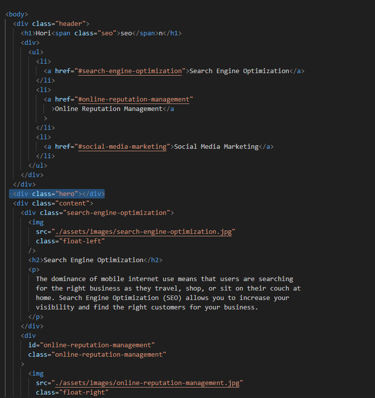
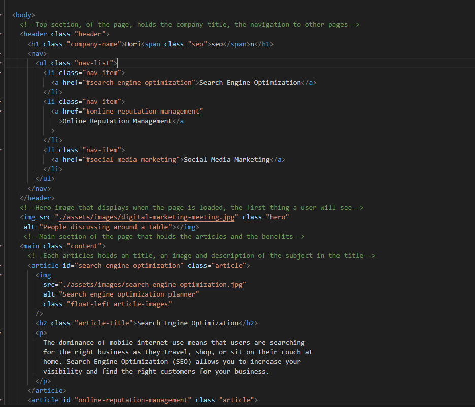

# Semantic HTML refactoring

## Description

**Taking a done page that doesn't use semantic HTML and then editing that base with the semantic modern versions.**

This will help me learn has helped me learn how to write semantic HTML without changing the look of the original page but making it more
descriptive and better for Search Engines and for people that are using screen readers. It showcased how that a page can be written in
multiple ways but that the semantic style in HTML is the best way to write web pages as they are help other developers understand the page
and also helps user with screen reader or other technologies as the screen reader will be able to understand the page better.

Furthermore, I learned the importants of making a clean and using the use of the dry principle to have no code that does the same thing twice.
This has helped understand CSS more and also help with making the CSS more understandable and readable. In addition to that, adding comments
so that I can look back and understand the CSS at a later date.

## Usage

The usefulness of this project is learning how to make a webpage more representable and easier for all parties to understand.

# License

There is isn't a license linked to the project at the current moment. (02/04/2023)

# Feature

A main page that shows that would show the users articles about the 3 subjects; Search Engine Optimazation,
Online Reputation Management, Social Media Marketing.

The main feature is for students to learn how to convert old webpages, that don't use semenatic HTML into a
semenatic HTML that is easy to understand.
