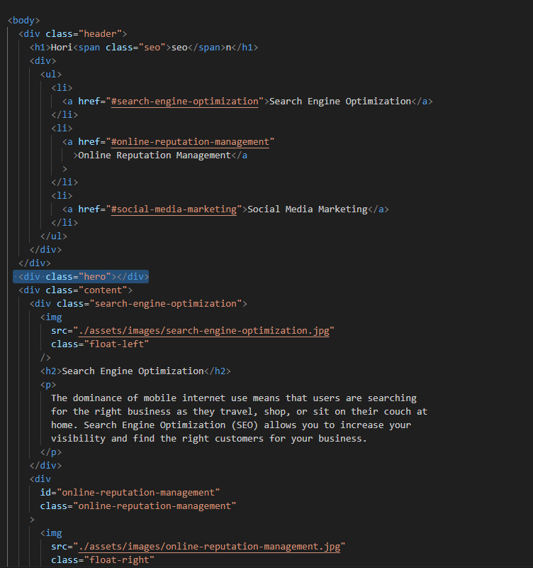
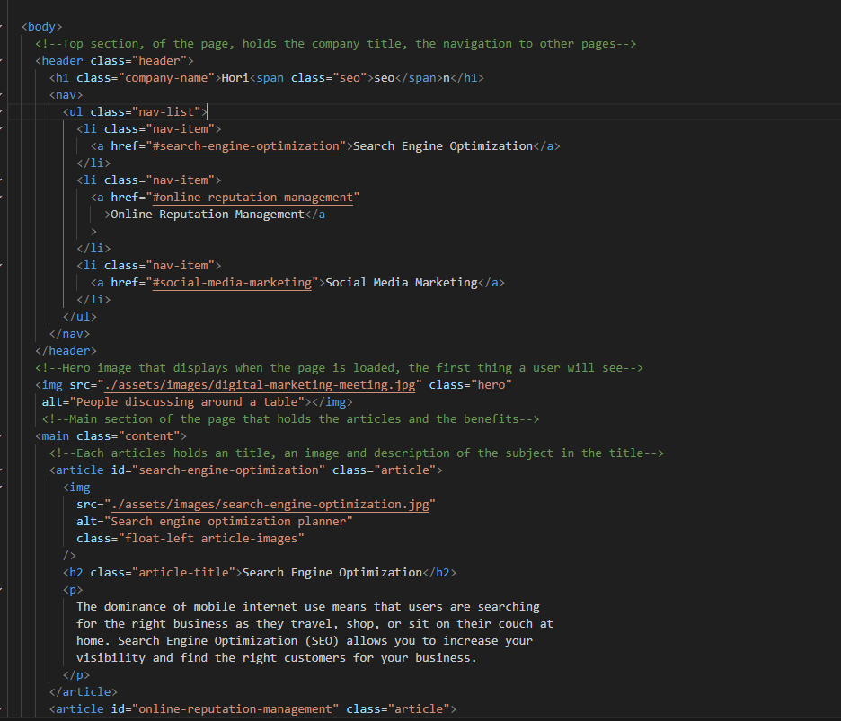

# Semantic HTML refactoring

## Description

### User Story

**Taking a done page that doesn't use semantic HTML and then editing that base with the semantic modern versions.**

```
AS A marketing agency
I WANT a codebase that follows accessibility standards
SO THAT our own site is optimized for search engines
```

### Acceptance Criteria

```
GIVEN a webpage meets accessibility standards
WHEN I view the source code
THEN I find semantic HTML elements
WHEN I view the structure of the HTML elements
THEN I find that the elements follow a logical structure independent of styling and positioning
WHEN I view the icon and image elements
THEN I find accessible alt attributes
WHEN I view the heading attributes
THEN they fall in sequential order
WHEN I view the title element
THEN I find a concise, descriptive title
```

## What I have Learnt

This has helped me learn how to write semantic HTML without changing the look of the original page but making it more
descriptive. This makes it better for Search Engines and for people that are using screen readers. It showcased that a page can be written in
multiple ways but that the semantic style in HTML is the best way to write web pages. The reason for this is it helps other developers understand the page
and also helps users that need screen readers or other technologies as the technologies will be able to understand the page better.

Furthermore, I learned the importance of making a clean and usable CSS, using the use of the dry principle to have no code that does the same thing twice.
This has helped me understand CSS more and also help with making the CSS more understandable and readable. In addition to that, adding comments
so that I can look back and understand the CSS at a later date.

## Usage

The usefulness of this project is learning how to make a webpage more representable and easier for all parties to understand.

### Non-Semantic HTML



### Semantic HTML



# License

There isn't a license linked to the project at the current moment. (02/04/2023)

# Feature

A main page that shows that would show the users articles about the 3 subjects; Search Engine Optimization,
Online Reputation Management, Social Media Marketing.

The main feature is for myself to learn how to convert old webpages, that don't use semantic HTML into a semantic HTML that are easy to understand.
